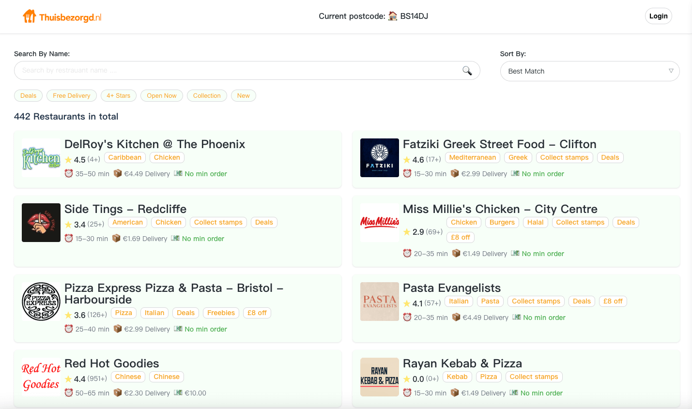

# 🍽️ Restaurant Finder

A modern restaurant discovery application built with React for the Takeaway assignment.



## ✨ Features

- ⚛️ React 19 with TypeScript strict typing
- 🧠 Redux Toolkit & Redux-Saga for state management
- ⚡ Vite-powered fast development experience
- 🧪 Comprehensive test suite (Jest + Playwright)
- 🛠️ Code quality tools (ESLint + Prettier)
- 🐳 Docker containerization with multi-stage builds
- 📱 Fully responsive design
- 🔄 Robust API error handling and loading states

## 🚀 Getting Started

### Prerequisites

- Node.js v18+
- npm v9+
- Docker (optional)

### Installation

```bash
# Clone repository
git clone https://github.com/AssassinLYZ/restaurant_finder.git
cd restaurant-finder

# Install dependencies
npm install

# Start development server
npm run dev

```
Setup environment:

```bash
# Copy environment file
cp .env.example .env

# Add your API keys
VITE_APP_GOOGLE_MAPS_API_KEY=your_key_here

```


🌐 API Integration
The application integrates with the Justeat API:


Development Mode
Configured in vite.config.ts

Proxies /api/* requests to Justeat API

Automatic CORS handling


🧪 Testing
Unit Tests

``` bash
npm test          # Run all tests
npm test:watch    # Watch mode
npm test:coverage # Generate coverage report
```

E2E Tests

``` bash
npm run e2e       # Run against dev server
npm run e2e:ci    # UI mode execution
```

🏗️ Build & Deployment
Build Commands
``` bash
npm run build     # Create production build
npm run preview   # Preview production build
```
## Production Mode

Docker Deployment

``` bash
# Build image
docker build -t restaurant-finder .

# Run container
docker run -d -p 3000:80 --name restaurant-app restaurant-finder
```


### Key Directories Explained:

1. **`pages/`**  
   Contains all route-level components organized by page:
   - `collection/`: For saved/favorite restaurants
   - `errorPage/`: Error boundary components
   - `main/`: Homepage/search functionality
   - `restaurant/`: Restaurant detail views

2. **`shared/`**  
   Houses all application infrastructure code:
   - `api/`: API service layer
   - `store/`: Redux store configuration
   - `components/`: Reusable presentational components
   - `theme/`: Styled-components or CSS-in-JS theming


This structure follows best practices for:
- Clear separation of concerns
- Scalable feature organization
- Reusable shared components
- Type-safe configuration


🛠️ Development Scripts

``` bash
npm run dev	#  Start development server
npm run build	# reate production build
npm run lint	# Run ESLint
npm run format	# Format code with Prettier
``` 


Future improvements:

- [ ] Implement real API authentication (OAuth/JWT)
- [ ] Increase unit test coverage
- [ ] Add Husky pre-commit hooks
- [ ] Integrate commitlint for conventional commits
- [ ] Setup CI/CD pipeline with GitHub Actions